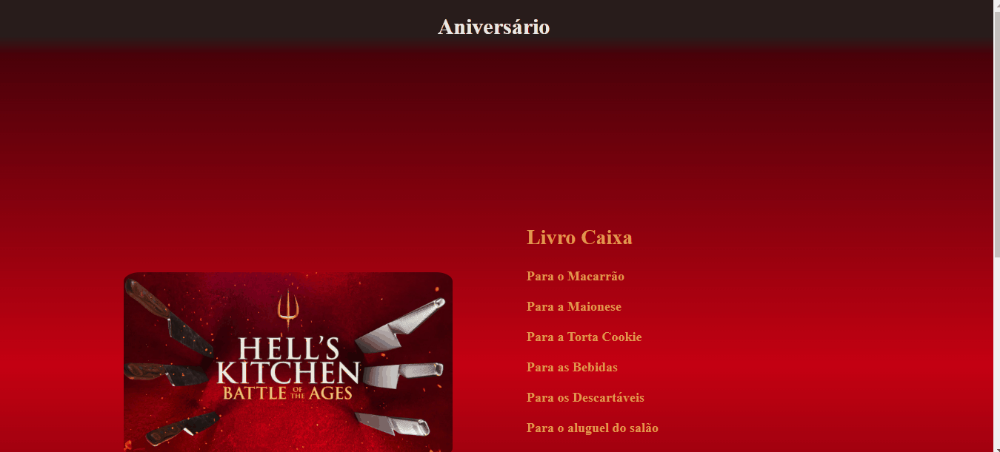

# anniversary-project
Projeto Pessoal inspirado em um planejamento, pessoal, de uma festa.

## Projeto

 
 

 

## Objetivos
Criar uma Landing page simples, com opções para clicar e dentro dela tabelas com as informções específicas.
 
 

## Tecnologias Ultilizadas
- HTML
- CSS
- JS
 
 

## Desafios
Conseguir fazer com que quando clicado um item se outro estiver aberto fechar.
Fazer uma cor de fundo fazendo degradê.